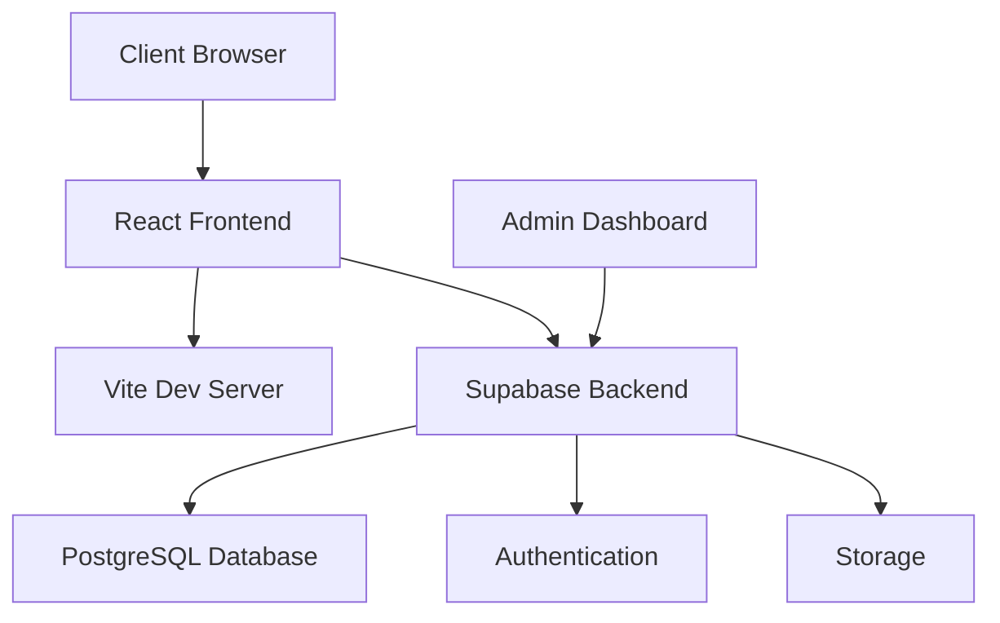
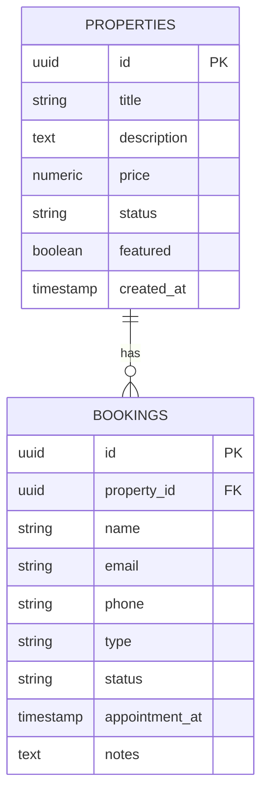

# Raslipwani Properties - Real Estate Platform


[](https://opensource.org/licenses/MIT)
[](https://reactjs.org/)
[](https://vitejs.dev/)
[](https://supabase.io/)

Raslipwani Properties is a comprehensive real estate management platform designed to streamline property listings, client bookings, and business operations. Built with modern technologies, this platform offers a seamless experience for both property managers and clients.



## ✨ Features Overview

### 🏠 Property Management

* **Listing Creation**: Easily add new properties with images, descriptions, and pricing
* **Status Tracking**: Mark properties as available, pending, or sold
* **Featured Properties**: Highlight premium listings on the homepage
* **Search & Filter**: Advanced search capabilities with filters by location, price, and features

### 🗓️ Booking System

* **Viewing Appointments**: Schedule and manage property viewings
* **Consultation Booking**: Allow clients to book expert consultations
* **Automated Reminders**: Email notifications for upcoming appointments
* **Status Management**: Track bookings as pending, confirmed, or cancelled

### 📊 Admin Dashboard

* **Analytics Dashboard**: Visualize key metrics and business performance
* **Recent Activity**: Track all system events in real-time
* **Booking Management**: Comprehensive interface for handling appointments
* **User Management**: Administer user roles and permissions

### 🌐 User Experience

* **Responsive Design**: Fully optimized for mobile, tablet, and desktop
* **Interactive UI**: Modern, intuitive interface with smooth animations
* **Favorites System**: Allow users to save preferred properties
* **Contact Forms**: Easy-to-use inquiry forms with validation

## 🛠 Technology Stack

### Frontend

| Technology   | Purpose              | Version |
| ------------ | -------------------- | ------- |
| React        | UI Component Library | 18.2.0  |
| Vite         | Frontend Tooling     | 4.4.5   |
| Tailwind CSS | Styling Framework    | 3.3.3   |
| React Router | Navigation           | 6.15.0  |
| React Icons  | Icon Library         | 4.10.1  |

### Backend & Database

| Service    | Purpose                 |
| ---------- | ----------------------- |
| Supabase   | Backend-as-a-Service    |
| PostgreSQL | Relational Database     |
| PostgREST  | REST API for PostgreSQL |

### Deployment & Infrastructure

| Service        | Purpose          |
| -------------- | ---------------- |
| Vercel         | Frontend Hosting |
| Supabase       | Backend Hosting  |
| GitHub Actions | CI/CD Pipelines  |

## 🚀 Getting Started

### Prerequisites

* Node.js v18+
* npm v9+
* Supabase account
* Git

### Installation Guide

```bash
# Clone the repository
git clone https://github.com/your-username/raslipwani-properties.git
cd raslipwani-properties

# Install dependencies
npm install

# Set up environment variables
cp .env.example .env

# Start development server
npm run dev
```

### Configuration

Create a `.env` file with the following configuration:

```env
# Supabase Configuration
VITE_SUPABASE_URL=https://your-project.supabase.co
VITE_SUPABASE_ANON_KEY=your-anon-key

# Application Settings
VITE_SITE_NAME=Raslipwani Properties
VITE_CONTACT_EMAIL=info@raslipwani.com
```

## 📈 Database Schema

### Diagram



## 🚀 Deployment

### Production Deployment

```bash
# Build production bundle
npm run build

# Deploy to Vercel
vercel --prod
```

### Supabase Setup

* Create a new project at [supabase.io](https://supabase.io)
* Run the initialization SQL script:

```sql
-- Create tables
CREATE TABLE properties (
  id UUID DEFAULT extensions.uuid_generate_v4() PRIMARY KEY,
  title TEXT NOT NULL,
  description TEXT,
  price NUMERIC,
  featured BOOLEAN DEFAULT false,
  status VARCHAR(20) DEFAULT 'available'
);

CREATE TABLE bookings (
  id UUID DEFAULT extensions.uuid_generate_v4() PRIMARY KEY,
  property_id UUID REFERENCES properties(id),
  name TEXT NOT NULL,
  email TEXT NOT NULL,
  phone TEXT NOT NULL,
  type TEXT NOT NULL,
  status TEXT DEFAULT 'pending',
  appointment_at TIMESTAMPTZ,
  notes TEXT,
  created_at TIMESTAMPTZ DEFAULT NOW()
);
```

## 📂 Project Structure

```
raslipwani-properties/
├── public/                 # Static assets
├── src/
│   ├── components/         # Reusable components
│   ├── pages/              # Application pages
│   │   ├── admin/          # Admin dashboard
│   │   │   ├── Dashboard.jsx
│   │   │   ├── Bookings.jsx
│   │   │   └── Properties.jsx
│   │   ├── Home.jsx
│   │   ├── Properties.jsx
│   │   ├── Contact.jsx
│   │   └── ...
│   ├── utils/              # Utility functions
│   │   └── supabaseClient.js
│   ├── App.jsx             # Main application
│   └── main.jsx            # Entry point
├── .env.example            # Environment template
├── vite.config.js          # Vite configuration
├── package.json            # Dependencies
└── README.md               # Project documentation
```

## 📸 Application Preview

| Feature            | Preview                                                                               |
| ------------------ | ------------------------------------------------------------------------------------- |
| Admin Dashboard    |   |
| Property Listing   |  |
| Booking Management |     |
| Contact Page       |        |

## 🤝 Contributing

We welcome contributions from the community. Please follow these guidelines:

1. Fork the repository
2. Create a feature branch (`git checkout -b feature/your-feature`)
3. Commit your changes (`git commit -am 'Add some feature'`)
4. Push to the branch (`git push origin feature/your-feature`)
5. Open a pull request

### Development Standards

* Follow React best practices and component design patterns
* Use descriptive variable and function names
* Add PropTypes for all components
* Include unit tests for complex logic
* Maintain consistent code formatting with Prettier
* Write comprehensive documentation for new features

## 🔬 Testing

```bash
# Run unit tests
npm test

# Run end-to-end tests
npm run test:e2e
```

## 📜 License

This project is licensed under the MIT License - see [LICENSE](https://github.com/voyyani/raslipwani-properties/blob/main/LICENSE) for details.

## 📬 Contact

For inquiries or support, contact our development team:

* **Project Lead**: NGOWA CHEMBE KARISA
* **GitHub**: [https://github.com/voyyani](https://github.com/voyyani)
* **Project Website**: [https://raslipwani.com](https://raslipwani.com)
